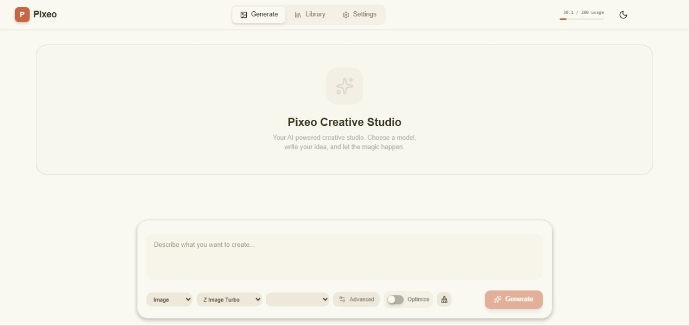
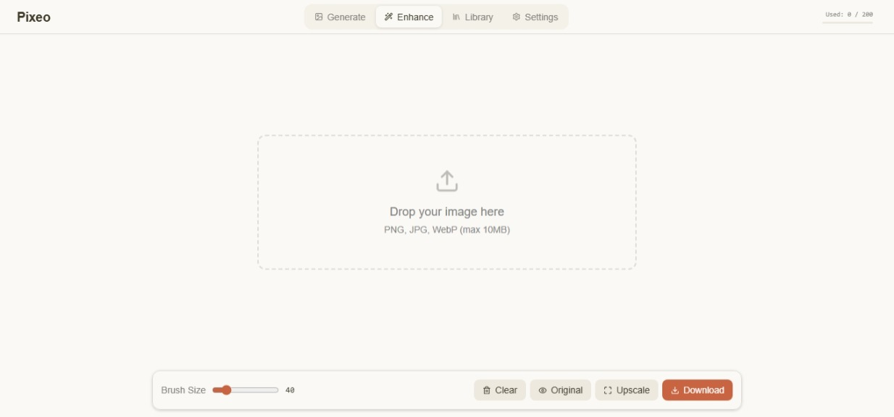
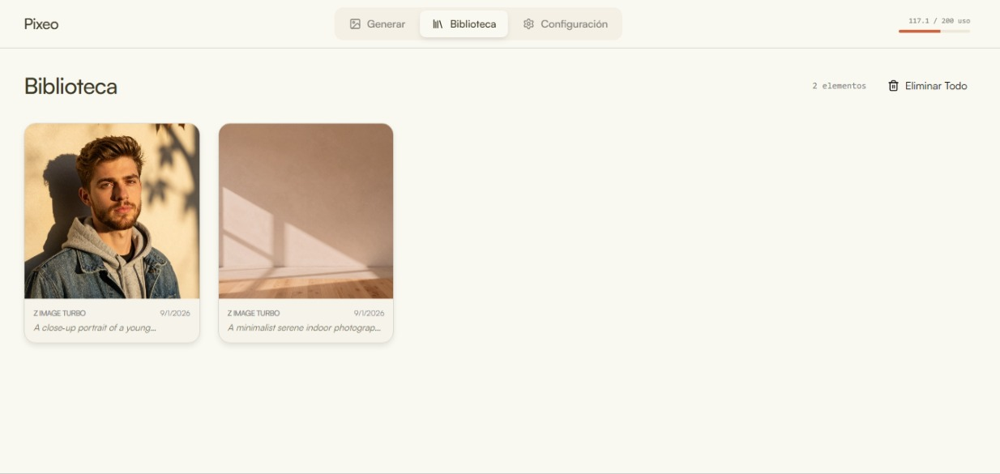
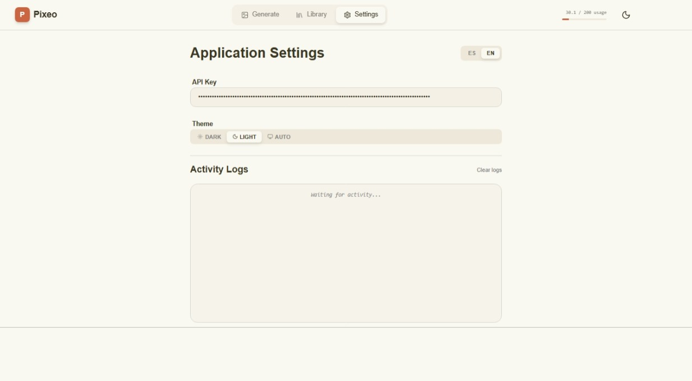
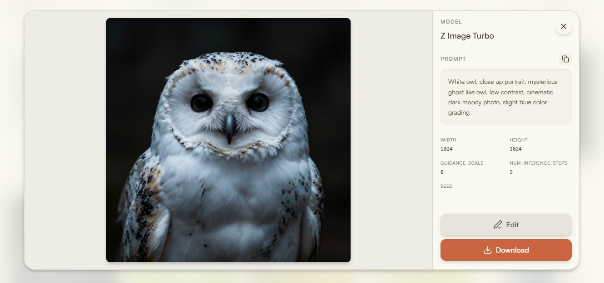

<div align="center">
  
  <h1>Pixeo</h1>
  <p>
    <b>A modern web application for generating images, editing images, and creating videos using the Chutes AI platform. Built with Vue 3, TypeScript, and Tailwind CSS.</b>
  </p>
</div>

## 📸 Screenshots

| Image Generation | Inpaint/Enhance | Library | Settings | Zoom Modal |
|------------------------|-----------------|---------------|---------------|---------------|
|  |  |  |  |  |

## ✨ Features

- **Image Generation**: Create high-quality images using advanced AI models like Z Image Turbo, Qwen Image, FLUX.1 Dev, and more.
- **Image Editing**: Edit existing images with specialized models like Qwen Image Edit.
- **Inpaint/Enhance**: Locally enhance and edit images by drawing masks and using AI-powered inpainting with ONNX models in the browser.
- **Video Generation**: Create videos from text or images with models like Wan2.1 14B Video.
- **Text to Speech**: Convert text to audio with TTS models like Kokoro and CSM 1B.
- **Personal Library**: Store and manage all your generated content locally.
- **Intuitive Interface**: Modern design with four main tabs: Generate/Edit, Inpaint/Enhance, Library, and Settings.
- **Multi-language Support**: Available in Spanish and English.
- **Local Storage**: Uses IndexedDB to save content without needing a server.
- **Real-time Notifications**: Receive immediate feedback on your generation progress.
- **Prompt Optimization**: Some models support automatic prompt enhancement for better results.

## ⚠️ Project Status

- **Image Generation**: ✅ Working
- **Image Editing**: ✅ Working
- **Inpaint/Enhance**: ✅ Working
- **Video Generation**: Not Tested
- **Text to Speech**: Not Tested

> **Note**: Some models may be outdated. If you find any model that doesn't work properly, please report it.

## 🚀 Technologies

- **Framework**: Vue 3 with Composition API
- **Language**: TypeScript
- **Bundler**: Vite
- **Styles**: Tailwind CSS with shadcn/ui components
- **State Management**: Pinia
- **Internationalization**: vue-i18n
- **Icons**: Lucide Vue Next
- **Notifications**: vue-sonner
- **Storage**: IndexedDB with idb
- **UI Components**: Radix UI with class-variance-authority

## 📦 Installation

1. Clone the repository:
```bash
git clone <repository-url>
cd pixeo
```

2. Install dependencies:
```bash
npm install
# or
bun install
```

3. Start the development server:
```bash
npm run dev
# or
bun run dev
```

4. Open your browser at `http://localhost:5173`

## 🛠️ Available Scripts

- `npm run dev` - Start the development server
- `npm run build` - Build the application for production
- `npm run preview` - Preview the production build
- `npm run lint` - Run ESLint to verify code

## 🎯 Usage

### Initial Setup
1. Go to the **Settings** tab
2. Enter your Chutes AI API key
3. The application will automatically verify your available quota

### Generate Content
1. Select the **Generate/Edit** tab
2. Choose the mode: Image, Edit, Video, or Audio
3. Select an available model
4. Configure resolution and advanced parameters
5. Write your prompt
6. (Optional) Enable "Optimize Prompt" if available for the selected model
7. Click "Generate"

### Enhance Images (Inpaint)
1. Go to the **Library** tab and zoom into any generated image
2. Click the **Enhance** button in the zoom modal
3. The image will load into the **Inpaint/Enhance** tab
4. Draw masks on areas you want to enhance or modify
5. Adjust brush size as needed
6. The AI will process the image locally in your browser using ONNX models
7. Compare original and enhanced versions with the toggle
8. Download the enhanced result

### Prompt Optimization
Some models support automatic prompt optimization through specialized AI experts. When enabled, the original prompt is analyzed and rewritten to enhance visual details, properly handle text content in images, and specify artistic style appropriately.

This feature is available for the following models:
- **qwen-image** - General image prompt enhancer
- **qwen-image-2512** - Portrait-focused image prompt enhancer
- **qwen-image-edit-2509** - Edit prompt enhancer
- **qwen-image-edit-2511** - Edit prompt enhancer (v2)
- **z-image-turbo** - Visionary artist prompt enhancer

The optimization configuration is located in `src/config/optimize_prompts.json`.

### Manage Library
- The **Library** tab shows all your generated content
- Use zoom to view complete details
- Download content individually
- Clear the current session with the brush button

## 🏗️ Project Architecture

```
src/
├── components/          # Reusable Vue components
│   ├── generate/        # Generation components
│   ├── inpaint/         # Inpaint/enhance components
│   ├── library/         # Library components
│   └── settings/        # Settings components
├── config/              # Model and resolution configurations
├── i18n/                # Internationalization files
├── lib/                 # Utilities and helpers
├── services/            # API services (Chutes AI) and inpaint processor
├── stores/              # Global state with Pinia
└── types/               # TypeScript definitions
```

## 🤖 Supported Models

### Image Generation
- Z Image Turbo
- Hunyuan Image 3
- Qwen Image / Qwen Image 2512
- HiDream
- FLUX.1 Dev
- JuggernautXL
- Chroma
- iLustMix
- Neta Lumina
- Wan2.1 14B
- And more...

### Image Editing
- Qwen Image Edit 2509/2511

### Video Generation
- Wan2.1 14B Video
- Wan 2.2 I2V 14B Fast

### Text to Speech
- Kokoro
- CSM 1B

## 🌐 Internationalization

The application supports Spanish and English. Translation files are located in `src/i18n/`.

## 📱 Technical Features

- **Responsive Design**: Works on desktop and mobile
- **Dark/Light Theme**: Switch between modes with the button in the top bar
- **Offline Storage**: Works without internet connection (except for generating content)
- **Quota Management**: Monitor your API usage in real-time
- **Detailed Logging**: Log all operations in settings

## 🔧 Development

### Model Structure
Models are configured in `src/config/models_data.ts`. Each model includes:
- API endpoint
- Available parameters
- Supported resolutions
- Parameter mapping

### Adding New Models
1. Add the configuration in `models_data.ts`
2. Update exports in `models.ts`
3. Restart the application

### Resolution Customization
See `src/config/custom_resolutions.md` to learn how to define custom resolutions.

> This project is based on the original idea from [chutes-img-ui](https://github.com/MagicGoddess/chutes-img-ui).
---

## 💡 Technical Note

This application is **vibe coded**, which means it was built quickly and practically to fulfill its purpose. As such, it may not be properly optimized and could contain code that doesn't follow development best practices. Any improvement or optimization is welcome.
