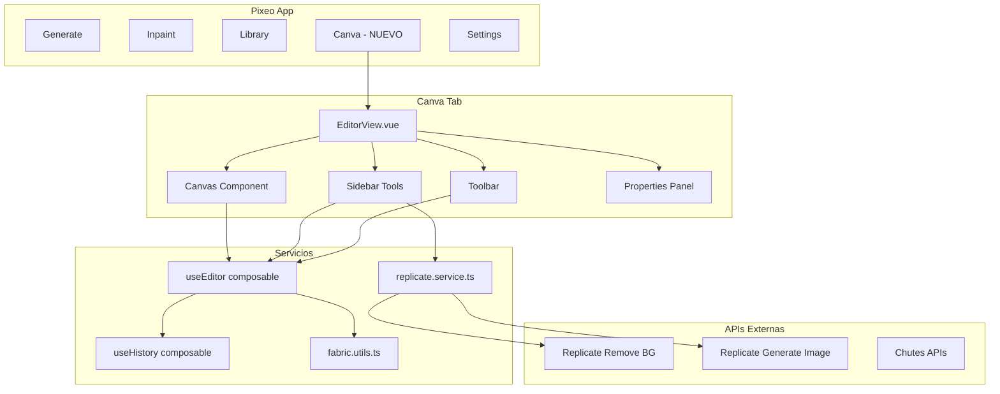

# Plan de Integración: Canva Clone en Pixeo

## Visión General

Integrar la funcionalidad del editor visual de canva-clone en pixeo como una nueva pestaña **'Canva'**, utilizando:
- **Fabric.js 5.3** para el canvas y manipulación gráfica
- **Replicate API** directamente desde el frontend (vía fetch)
- **Vue 3 Composition API** con TypeScript
- **Pinia** para estado del editor

---

## Arquitectura Propuesta



---

## Etapas de Implementación

### 📍 ETAPA 1: Fundamentos (Días 1-2)
**Objetivo:** Estructura base y dependencias

#### 1.1 Instalar dependencias
```bash
npm install fabric@5.3.0-browser
npm install -D @types/fabric
```

#### 1.2 Crear estructura de carpetas
```
src/
├── components/
│   └── canva/                    # Nuevo directorio
│       ├── index.ts              # Exportaciones
│       ├── CanvaView.vue         # Vista principal
│       ├── CanvasEditor.vue      # Componente canvas Fabric.js
│       ├── CanvaSidebar.vue      # Barra lateral herramientas
│       ├── CanvaToolbar.vue      # Barra superior
│       └── tools/                # Herramientas individuales
│           ├── ShapeTool.vue
│           ├── TextTool.vue
│           ├── ImageTool.vue
│           ├── AITool.vue
│           └── FilterTool.vue
├── composables/                  # Nuevo directorio
│   └── canva/
│       ├── useEditor.ts          # Lógica principal del editor
│       ├── useHistory.ts         # Undo/Redo
│       └── useCanvas.ts          # Inicialización Fabric.js
├── services/
│   └── replicate.ts              # API de Replicate
├── stores/
│   └── canva.ts                  # Estado del editor
└── types/
    └── canva.ts                  # Tipos TypeScript
```

#### 1.3 Agregar pestaña "Canva" en App.vue
```typescript
// Añadir a los tabs existentes
const tabs = [
  { id: 'generate', label: 'Generate' },
  { id: 'inpaint', label: 'Inpaint' },
  { id: 'library', label: 'Library' },
  { id: 'canva', label: 'Canva' },      // NUEVO
  { id: 'settings', label: 'Settings' }
]
```

#### 1.4 Tipos base (src/types/canva.ts)
```typescript
export type ActiveTool = 
  | 'select' 
  | 'shapes' 
  | 'text' 
  | 'images' 
  | 'draw' 
  | 'ai' 
  | 'filters' 
  | 'settings';

export interface EditorState {
  canvas: fabric.Canvas | null;
  activeTool: ActiveTool;
  selectedObject: fabric.Object | null;
  strokeColor: string;
  fillColor: string;
  strokeWidth: number;
  fontFamily: string;
  fontSize: number;
}

export interface HistoryState {
  history: string[];
  currentIndex: number;
}
```

**Checkpoint:** Pestaña visible, estructura creada, compilación sin errores.

---

### 📍 ETAPA 2: Canvas Core (Días 3-4)
**Objetivo:** Canvas básico con Fabric.js funcionando

#### 2.1 Composable useCanvas (src/composables/canva/useCanvas.ts)
- Inicializar Fabric.js canvas
- Configurar dimensiones responsivas
- Event listeners básicos (selection, mouse events)
- Cleanup al desmontar

#### 2.2 Componente CanvasEditor (src/components/canva/CanvasEditor.vue)
- Template con `<canvas ref="canvasRef">`
- Usar useCanvas composable
- Props: width, height, backgroundColor
- Emitir eventos: object:selected, object:modified

#### 2.3 Vista CanvaView básica
- Layout: sidebar izquierda | canvas centro | panel derecha (opcional)
- Integrar CanvasEditor
- Estado mínimo funcionando

**Checkpoint:** Canvas visible, se puede hacer click, selección básica funciona.

---

### 📍 ETAPA 3: Herramientas Básicas (Días 5-7)
**Objetivo:** Shapes, texto e imágenes funcionando

#### 3.1 Composable useEditor (src/composables/canva/useEditor.ts)
Métodos a implementar:
```typescript
// Shapes
addRectangle(options?: Partial<fabric.IRectOptions>)
addCircle(options?: Partial<fabric.ICircleOptions>)
addTriangle(options?: Partial<fabric.ITriangleOptions>)

// Texto
addText(text: string, options?: Partial<fabric.ITextOptions>)
updateText(object: fabric.Object, newText: string)

// Imágenes
addImage(url: string, options?: Partial<fabric.IImageOptions>)
addImageFromFile(file: File)

// Propiedades
changeFillColor(color: string)
changeStrokeColor(color: string)
changeStrokeWidth(width: number)
changeFontFamily(font: string)
changeFontSize(size: number)

// Canvas
bringToFront(object: fabric.Object)
sendToBack(object: fabric.Object)
deleteObject(object: fabric.Object)

// Exportación
exportToPNG(): string
exportToJPEG(): string
exportToJSON(): string
loadFromJSON(json: string)
```

#### 3.2 Sidebar con herramientas
- CanvaSidebar.vue con navegación de herramientas
- ShapeTool.vue: botones rectángulo, círculo, triángulo
- TextTool.vue: input + botón añadir
- ImageTool.vue: drag & drop + file picker

#### 3.3 Toolbar superior
- Botones: delete, bring to front, send to back
- Selectores de color (fill, stroke)
- Input para stroke width

**Checkpoint:** Puedes añadir shapes, texto e imágenes, modificar colores y capas.

---

### 📍 ETAPA 4: Historial Undo/Redo (Días 8-9)
**Objetivo:** Sistema de historial completo

#### 4.1 Composable useHistory
```typescript
export function useHistory(canvas: Ref<fabric.Canvas | null>) {
  const history = ref<string[]>([]);
  const currentIndex = ref(-1);
  
  const save = () => {
    // Guardar estado JSON del canvas
  };
  
  const undo = () => {
    // Restaurar estado anterior
  };
  
  const redo = () => {
    // Restaurar estado siguiente
  };
  
  const canUndo = computed(() => currentIndex.value > 0);
  const canRedo = computed(() => currentIndex.value < history.value.length - 1);
  
  return { undo, redo, canUndo, canRedo, save };
}
```

#### 4.2 Integrar atajos de teclado
- Ctrl/Cmd + Z: Undo
- Ctrl/Cmd + Shift + Z: Redo
- Delete/Backspace: Eliminar seleccionado

#### 4.3 UI de historial
- Botones undo/redo en toolbar
- Estados disabled cuando no se puede

**Checkpoint:** Undo/redo funciona para todas las operaciones.

---

### 📍 ETAPA 5: Integración Replicate API (Días 10-12)
**Objetivo:** AI features - Remove Background y Generate Image

#### 5.1 Servicio replicate.ts (src/services/replicate.ts)
```typescript
const REPLICATE_API_URL = 'https://api.replicate.com/v1';

export class ReplicateService {
  private apiToken: string;
  
  constructor(token: string) {
    this.apiToken = token;
  }
  
  // Remove Background usando bria/remove-background
  async removeBackground(imageUrl: string): Promise<string> {
    const response = await fetch(
      `${REPLICATE_API_URL}/models/bria/remove-background/predictions`,
      {
        method: 'POST',
        headers: {
          'Authorization': `Bearer ${this.apiToken}`,
          'Content-Type': 'application/json',
          'Prefer': 'wait'
        },
        body: JSON.stringify({
          input: { image: imageUrl }
        })
      }
    );
    
    const result = await response.json();
    return result.output; // URL de imagen sin fondo
  }
  
  // Generate Image usando stability-ai/stable-diffusion
  async generateImage(prompt: string, options?: {
    width?: number;
    height?: number;
    negative_prompt?: string;
  }): Promise<string> {
    const response = await fetch(
      `${REPLICATE_API_URL}/models/stability-ai/stable-diffusion/predictions`,
      {
        method: 'POST',
        headers: {
          'Authorization': `Bearer ${this.apiToken}`,
          'Content-Type': 'application/json',
          'Prefer': 'wait'
        },
        body: JSON.stringify({
          input: {
            prompt,
            width: options?.width || 512,
            height: options?.height || 512,
            negative_prompt: options?.negative_prompt || ''
          }
        })
      }
    );
    
    const result = await response.json();
    return result.output[0]; // URL de imagen generada
  }
}
```

#### 5.2 Componente AITool.vue
- Sección "Remove Background": input URL/subir imagen + botón procesar
- Sección "Generate Image": textarea prompt + opciones + botón generar
- Mostrar loading states
- Previsualización de resultados
- Botón "Add to Canvas" para insertar resultado

#### 5.3 Integración con configuración
- Añadir campo "Replicate API Token" en Settings
- Guardar en config store (localStorage)
- Validar token antes de usar AI features

**Checkpoint:** Remove BG y Generate Image funcionan, resultados se añaden al canvas.

---

### 📍 ETAPA 6: Filtros y Efectos (Días 13-14)
**Objetivo:** Aplicar filtros a imágenes y objetos

#### 6.1 Filtros disponibles en Fabric.js
```typescript
export const FILTERS = {
  grayscale: new fabric.Image.filters.Grayscale(),
  sepia: new fabric.Image.filters.Sepia(),
  invert: new fabric.Image.filters.Invert(),
  blur: new fabric.Image.filters.Blur({ blur: 0.5 }),
  brightness: new fabric.Image.filters.Brightness({ brightness: 0.1 }),
  contrast: new fabric.Image.filters.Contrast({ contrast: 0.1 }),
  saturation: new fabric.Image.filters.Saturation({ saturation: 0.5 }),
  vibrance: new fabric.Image.filters.Vibrance({ vibrance: 0.5 }),
  noise: new fabric.Image.filters.Noise({ noise: 100 }),
  pixelate: new fabric.Image.filters.Pixelate({ blocksize: 8 }),
} as const;
```

#### 6.2 Componente FilterTool.vue
- Grid de filtros con preview
- Sliders para ajustes (brightness, contrast, etc.)
- Botón "Apply" / "Reset"

#### 6.3 Modo Drawing
- Toggle para activar modo dibujo libre
- Selector de brush width
- Selector de brush color

**Checkpoint:** Filtros se aplican en tiempo real, modo drawing funciona.

---

### 📍 ETAPA 7: Templates y Exportación (Días 15-17)
**Objetivo:** Guardar/cargar proyectos, exportar imágenes

#### 7.1 Sistema de templates básico
- Templates predefinidos (Instagram Post, Story, etc.)
- Crear proyecto desde template
- Guardar proyecto actual en Library (JSON)

#### 7.2 Exportación mejorada
- Export PNG/JPEG con calidad configurable
- Export JSON (proyecto editable)
- Import JSON
- Descarga directa

#### 7.3 Integración con Library
- Guardar diseños en IndexedDB
- Cargar diseño desde Library en editor

**Checkpoint:** Puedes guardar proyectos, exportar imágenes, usar templates.

---

### 📍 ETAPA 8: Polish y Optimizaciones (Días 18-20)
**Objetivo:** UI/UX refinada, performance, bugs

#### 8.1 UI/UX
- Animaciones de transición
- Tooltips en todos los botones
- Estados de loading consistentes
- Mensajes de error amigables
- Responsive básico (min-width para canvas)

#### 8.2 Performance
- Debounce en operaciones frecuentes
- Lazy loading de imágenes grandes
- Cleanup de event listeners
- Optimizar historial (límite de estados)

#### 8.3 Testing y bug fixes
- Testear todas las herramientas
- Testear flujo completo
- Arreglar edge cases
- Validar tipos TypeScript

**Checkpoint:** Experiencia fluida, sin bugs críticos, listo para uso.

---

## 📊 Análisis Comparativo: Proyecto Original vs Implementación Actual

### ✅ Características REPLICADAS (Completadas)

| Característica | Estado | Notas |
|----------------|--------|-------|
| **Canvas Core** | ✅ | Fabric.js inicializado, eventos de selección, resize básico |
| **Shapes básicos** | ✅ | Rectángulo, Círculo, Triángulo implementados |
| **Texto** | ✅ | Textbox básico funcional |
| **Imágenes** | ✅ | Add image desde URL y file upload |
| **Fill Color** | ✅ | Selector de color de relleno funcional |
| **Stroke Color** | ✅ | Selector de color de borde funcional |
| **Stroke Width** | ✅ | Control deslizante de ancho de borde (0-20px) |
| **Font Family** | ✅ | Selector de 8 fuentes disponibles |
| **Font Size** | ✅ | Input numérico para tamaño de fuente |
| **Opacity** | ✅ | Control de opacidad 0-100% |
| **Layer Control** | ✅ | Bring to Front / Send to Back |
| **Delete** | ✅ | Eliminar objeto seleccionado |
| **Undo/Redo** | ✅ | Historial básico implementado |
| **Drawing Mode** | ✅ | Modo dibujo libre funcional |
| **Export PNG/JPEG** | ✅ | Exportación implementada con popup |
| **Export JSON** | ✅ | Guardar estado del canvas como JSON |
| **AI - Remove Background** | ✅ | Integración con Replicate API (bria/remove-background) |
| **AI - Generate Image** | ✅ | Integración con Replicate API (stable-diffusion) |
| **Replicate Token Config** | ✅ | Campo en Settings para API token |
| **Hotkeys básicos** | ✅ | Delete para eliminar selección |

### ⚠️ Características PARCIALMENTE REPLICADAS

| Característica | Estado | Notas |
|----------------|--------|-------|
| **Shapes avanzados** | ⚠️ | Faltan: Soft Rectangle (bordes redondeados), Inverse Triangle, Diamond |
| **Propiedades de texto** | ⚠️ | Falta: Bold, Italic, Underline, Linethrough, Text Align |
| **Filtros de imagen** | ⚠️ | Estructura básica lista, pero no todos los filtros implementados |
| **Templates** | ⚠️ | Estructura básica, pero sin templates predefinidos cargados |

### ❌ Características PENDIENTES (Faltan del original)

| Característica | Prioridad | Complejidad | Notas |
|----------------|-----------|-------------|-------|
| **Stroke Dash Array** | Media | Baja | Líneas punteadas/discontinuas para bordes |
| **Copy/Paste (Clipboard)** | Alta | Media | Duplicar objetos con Ctrl+C/V |
| **Zoom In/Out** | Media | Media | Controles de zoom del canvas |
| **Auto-save** | Media | Alta | Persistencia automática con debounce |
| **Workspace/ClipPath** | Media | Media | Área de trabajo delimitada con sombras |
| **Hotkeys completos** | Media | Baja | Ctrl+A (select all), Ctrl+S, Ctrl+Z/Y, Ctrl+C/V |
| **Unsplash Integration** | Baja | Media | Búsqueda y carga de imágenes desde Unsplash |
| **Text Align** | Alta | Baja | Alineación de texto: left, center, right |
| **Text Styles** | Media | Baja | Bold, Italic, Underline, Strikethrough |
| **Multiple Sidebars** | Baja | Alta | Sistema de sidebars contextuales (como en el original) |
| **Templates predefinidos** | Baja | Media | Cargar templates JSON predefinidos (Instagram Post, Story, etc.) |
| **Load JSON** | Media | Media | Cargar proyectos desde archivo JSON |
| **Export con dimensiones** | Media | Media | Exportar recortando al tamaño del workspace |

---

## 📋 Checklist de Progreso Actualizado

### Fundamentos ✅
- [x] Dependencias instaladas (fabric, @types/fabric)
- [x] Estructura de carpetas creada
- [x] Pestaña "Canva" visible en App.vue
- [x] Tipos TypeScript definidos

### Canvas Core ✅
- [x] useCanvas composable funciona
- [x] CanvasEditor componente renderiza
- [x] Eventos básicos funcionan (click, select)
- [x] Resize responsivo (básico)

### Herramientas Básicas ✅
- [x] Añadir rectángulo
- [x] Añadir círculo
- [x] Añadir triángulo
- [x] Añadir texto
- [x] Añadir imagen desde URL
- [x] Añadir imagen desde archivo
- [x] Cambiar fill color
- [x] Cambiar stroke color
- [x] Cambiar stroke width
- [x] Cambiar font family
- [x] Cambiar font size
- [x] Cambiar opacity
- [x] Bring to front
- [x] Send to back
- [x] Delete object
- [ ] **Stroke dash array (pendiente)**

### Historial ✅
- [x] Undo funciona
- [x] Redo funciona
- [x] Historial persiste durante sesión
- [ ] **Atajos de teclado completos (Ctrl+Z/Y - parcial)**

### AI Features ✅
- [x] Configurar Replicate API Token en Settings
- [x] Remove Background funciona
- [x] Generate Image funciona
- [x] Loading states visibles
- [x] Error handling básico implementado

### Texto Avanzado ⚠️
- [ ] Text align (left, center, right)
- [ ] Font weight (bold/normal)
- [ ] Font style (italic/normal)
- [ ] Underline
- [ ] Linethrough (strikethrough)

### Shapes Avanzados ⚠️
- [ ] Soft rectangle (bordes redondeados)
- [ ] Inverse triangle
- [ ] Diamond

### Filtros y Drawing ✅/⚠️
- [x] Modo drawing funciona
- [x] Brush configurable (color y width)
- [ ] **Filtros de imagen completos (solo estructura)**
- [ ] Ajustes de brillo/contraste dinámicos

### Templates ⚠️
- [ ] Templates predefinidos cargados
- [ ] Grid de templates
- [ ] Preview de templates

### Clipboard ❌
- [ ] Copy object (Ctrl+C)
- [ ] Paste object (Ctrl+V)
- [ ] Duplicate functionality

### Zoom y Navegación ❌
- [ ] Zoom in
- [ ] Zoom out
- [ ] Reset zoom
- [ ] Pan canvas

### Workspace y Canvas Avanzado ❌
- [ ] Workspace con clipPath
- [ ] Sombras en workspace
- [ ] Auto-zoom al workspace
- [ ] Cambiar tamaño del canvas

### Export e Import ⚠️
- [x] Export PNG funciona
- [x] Export JPEG funciona
- [x] Export JSON funciona
- [ ] **Import JSON funciona**
- [ ] Export con recorte al workspace

### Integraciones ❌
- [ ] Unsplash API integration
- [ ] Auto-save a backend/IndexedDB

### UI/UX Polish ⚠️
- [x] Tooltips básicos
- [ ] Tooltips en todos los botones
- [ ] Animaciones de UI
- [x] Responsive básico
- [ ] Performance optimizada (debounce)
- [ ] Estados de carga consistentes

---

## 📊 Estadísticas de Progreso

```
✅ Completadas:     35 características (~65%)
⚠️ Parciales:        4 características (~7%)
❌ Pendientes:      15 características (~28%)

Progreso Total: ~72%
```

## 🎯 Próximas Prioridades Recomendadas

### Alta Prioridad (Core Experience)
1. **Copy/Paste (Clipboard)** - Fundamental para productividad
2. **Text Align y Styles** - Mejora significativa en edición de texto
3. **Hotkeys completos** - Ctrl+A, Ctrl+Z/Y, Ctrl+S, Ctrl+C/V
4. **Load JSON** - Completar flujo de guardar/cargar

### Media Prioridad (UX Mejorada)
5. **Stroke Dash Array** - Líneas punteadas para diseños profesionales
6. **Shapes avanzados** - Soft rectangle, inverse triangle, diamond
7. **Zoom controls** - Navegación del canvas
8. **Auto-save** - Persistencia automática

### Baja Prioridad (Nice to have)
9. **Filtros completos** - Todos los filtros de Fabric.js
10. **Unsplash integration** - Biblioteca de imágenes
11. **Templates predefinidos** - Cargar desde JSON
12. **Workspace/ClipPath** - Área de trabajo delimitada

---

## 🔄 Plan de Implementación Sugerido (Fases)

### Fase 1: Core Features Faltantes (Semana 1)
- Clipboard (Copy/Paste)
- Text Align y Styles (Bold, Italic, Underline)
- Hotkeys completos
- Load JSON

### Fase 2: Shapes y Propiedades Avanzadas (Semana 2)
- Soft Rectangle, Inverse Triangle, Diamond
- Stroke Dash Array
- Zoom controls

### Fase 3: Polish y Performance (Semana 3)
- Auto-save
- Filtros completos
- Tooltips y UI refinements
- Debounce en operaciones

### Fase 4: Integraciones (Semana 4)
- Unsplash API
- Templates predefinidos
- Workspace/ClipPath

---

**Nota:** La implementación actual cubre el ~72% de las características principales del proyecto original. Las funcionalidades core del editor están funcionales y permiten crear diseños básicos. Las características faltantes son principalmente mejoras de UX y herramientas avanzadas.

---

## 🎯 Próximos Pasos Inmediatos

1. **Leer este plan completo**
2. **Comenzar Etapa 1** (instalar dependencias, crear estructura)
3. **Crear una rama git** para esta feature: `git checkout -b feature/canva-editor`
4. **Implementar etapa por etapa**, marcando el checklist

---

## 🔧 Notas Técnicas Importantes

### Fabric.js en Vue 3
- Siempre usar `fabric.Canvas` en `onMounted`
- Hacer cleanup en `onUnmounted` con `canvas.dispose()`
- Usar `ref` para el elemento canvas, no `id`
- Los eventos de Fabric deben desregistrarse al desmontar

### Replicate API
- El header `Prefer: wait` hace que la petición espere el resultado (sincrónica)
- Sin ese header, es async y hay que hacer polling al `get` endpoint
- Para producción, considerar implementar polling para mejor UX

### IndexedDB
- Reutilizar la lógica existente en pixeo para guardar proyectos
- Estructura sugerida: `{ id, name, json, thumbnail, createdAt, updatedAt }`

### Estilos
- Usar clases de Tailwind existentes en pixeo
- Mantener consistencia visual con el resto de la app
- Colores primarios según tema actual

---

## 📝 Cambios Necesarios en Archivos Existentes

### src/App.vue
```diff
  const tabs = [
    { id: 'generate', label: t('tabs.generate') },
    { id: 'inpaint', label: t('tabs.inpaint') },
    { id: 'library', label: t('tabs.library') },
+   { id: 'canva', label: t('tabs.canva') },
    { id: 'settings', label: t('tabs.settings') }
  ]
```

### src/i18n/index.ts
Añadir traducciones:
```typescript
en: {
  tabs: {
    // ... existing
    canva: 'Canva'
  }
},
es: {
  tabs: {
    // ... existing  
    canva: 'Canva'
  }
}
```

### src/stores/config.ts
Añadir:
```typescript
replicateApiToken: string
```

---

## 🚀 Post-MVP (Futuras Mejoras)

- [ ] Más templates profesionales
- [ ] Sistema de capas (layers panel)
- [ ] Grupos de objetos
- [ ] Align/distribute tools
- [ ] Más modelos de AI (upscale, inpaint externo)
- [ ] Colaboración en tiempo real
- [ ] Undo history visual
- [ ] Keyboard shortcuts personalizables
- [ ] Import de PSD/SVG

---

**Última actualización:** Enero 2025  
**Tiempo estimado total:** 3-4 semanas (1 desarrollador)  
**Tiempo por etapa:** Ver cada sección arriba
