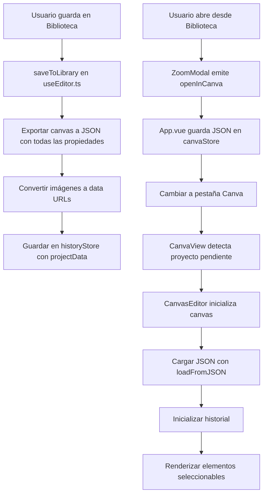

# Análisis: Flujo de Guardado y Carga de Proyectos Canva

## Resumen Ejecutivo

El flujo actual de guardado y carga de proyectos Canva tiene varios problemas críticos que impiden que los usuarios puedan editar correctamente los diseños guardados en la biblioteca.

---

## Problemas Identificados

### 1. JSON_KEYS Incompletos

**Ubicación:** [`src/composables/canva/useEditor.ts:569`](../src/composables/canva/useEditor.ts:569)

**Problema:**
```typescript
// Actual (incompleto)
return JSON.stringify(canvas.value.toJSON(['id', 'selectable', 'evented', 'hasControls', 'hasBorders']));
```

**Debería ser:**
```typescript
// Completo (basado en proyecto original)
const JSON_KEYS = ['name', 'gradientAngle', 'selectable', 'hasControls', 'linkData', 'editable', 'extensionType', 'extension'];
return JSON.stringify(canvas.value.toJSON(JSON_KEYS));
```

**Impacto:** Las propiedades faltantes causan que elementos no mantengan sus características al recargar (nombres, gradientes, etc.)

---

### 2. Mecanismo de Carga No Implementado

**Ubicación:** [`src/App.vue:428-446`](../src/App.vue:428-446)

**Problema:** El método `handleOpenInCanva` guarda el JSON en localStorage pero no hay código que lo lea y cargue:

```typescript
async function handleOpenInCanva(item: HistoryItem) {
    if (!item.projectData?.json) {
        toast.error("No project data available");
        return;
    }
    activeTab.value = 'canva';
    closeZoom();
    // ⚠️ PROBLEMA: Guarda en localStorage pero nadie lo lee
    localStorage.setItem('pixeo_canva_pending_project', item.projectData.json);
    toast.success(t("library.projectOpenedInCanva") || "Project opened in Canva editor");
}
```

**Solución requerida:** Implementar un mecanismo de comunicación entre componentes o usar el store de Canva para pasar el proyecto pendiente.

---

### 3. Falta Hook de Carga de Estado

**Comparación con proyecto original:** [`canva-clone/src/features/editor/hooks/use-load-state.ts`](../../canva-clone/src/features/editor/hooks/use-load-state.ts)

El proyecto original tiene un hook dedicado `useLoadState` que:
1. Escucha cambios en el estado inicial
2. Carga el JSON en el canvas
3. Reinicializa el historial
4. Aplica auto-zoom

**Implementación necesaria en proyecto actual:**

```typescript
// Nuevo composable: src/composables/canva/useLoadState.ts
import { ref, watch, type Ref } from 'vue';
import type { FabricNamespace } from '../../lib/fabric';

type fabric = FabricNamespace;

interface UseLoadStateOptions {
    canvas: Ref<fabric.Canvas | null>;
    initialJson: Ref<string | null>;
    onLoaded?: () => void;
}

export function useLoadState({ canvas, initialJson, onLoaded }: UseLoadStateOptions) {
    const isLoaded = ref(false);

    watch([canvas, initialJson], ([fabricCanvas, json]) => {
        if (!isLoaded.value && fabricCanvas && json) {
            const data = JSON.parse(json);
            
            fabricCanvas.loadFromJSON(data, () => {
                fabricCanvas.renderAll();
                onLoaded?.();
                isLoaded.value = true;
            });
        }
    }, { immediate: true });

    function reset() {
        isLoaded.value = false;
    }

    return { isLoaded, reset };
}
```

---

### 4. Manejo de Recursos (Imágenes)

**Problema:** Las imágenes en el canvas pueden provenir de:
1. URLs externas (CORS) - pueden fallar al guardar
2. Blobs locales (generadas por AI) - necesitan ser convertidas a data URLs

**Solución propuesta:**

```typescript
// En useEditor.ts, antes de exportar a JSON
async function prepareImagesForExport(canvas: fabric.Canvas): Promise<void> {
    const objects = canvas.getObjects();
    
    for (const obj of objects) {
        if (obj instanceof fabric.Image) {
            const img = obj as fabric.Image;
            
            // Si la imagen tiene src pero no es data URL, convertirla
            if (img.getSrc && !img.getSrc().startsWith('data:')) {
                try {
                    const dataUrl = await convertImageToDataUrl(img.getSrc());
                    img.setSrc(dataUrl);
                } catch (e) {
                    console.warn('Failed to convert image to data URL:', e);
                }
            }
        }
    }
}

async function convertImageToDataUrl(url: string): Promise<string> {
    return new Promise((resolve, reject) => {
        const img = new Image();
        img.crossOrigin = 'anonymous';
        img.onload = () => {
            const canvas = document.createElement('canvas');
            canvas.width = img.width;
            canvas.height = img.height;
            const ctx = canvas.getContext('2d')!;
            ctx.drawImage(img, 0, 0);
            resolve(canvas.toDataURL());
        };
        img.onerror = reject;
        img.src = url;
    });
}
```

---

### 5. Persistencia de Dimensiones del Canvas

**Problema:** Al cargar un proyecto, las dimensiones del canvas deben restaurarse.

**Solución en `CanvaView.vue`:**

```typescript
// Agregar watcher para cargar proyecto pendiente
import { useCanvaStore } from '../../stores/canva';

const canvaStore = useCanvaStore();
const pendingProject = ref<string | null>(null);

// Al montar el componente
onMounted(() => {
    const saved = localStorage.getItem('pixeo_canva_pending_project');
    if (saved) {
        pendingProject.value = saved;
        localStorage.removeItem('pixeo_canva_pending_project');
    }
});

// En onCanvasReady, cargar el proyecto si existe
function onCanvasReady(fabricCanvas: fabric.Canvas) {
    setCanvas(fabricCanvas);
    
    if (pendingProject.value) {
        loadFromJSON(pendingProject.value);
        pendingProject.value = null;
    } else {
        initHistory();
    }
}
```

---

## Diagrama de Flujo Recomendado



---

## Lista de Cambios Requeridos

### Archivos a Modificar:

1. **[`src/composables/canva/useEditor.ts`**](../src/composables/canva/useEditor.ts)
   - Actualizar `exportToJSON()` con JSON_KEYS completos
   - Agregar función para convertir imágenes a data URLs antes de exportar
   - Agregar `projectData` con dimensiones del canvas

2. **[`src/stores/canva.ts`**](../src/stores/canva.ts)
   - Agregar estado `pendingProjectJson` para almacenar proyecto pendiente
   - Agregar actions `setPendingProjectJson()` y `clearPendingProjectJson()`

3. **[`src/App.vue`**](../src/App.vue)
   - Modificar `handleOpenInCanva` para usar el store en lugar de localStorage

4. **[`src/components/canva/CanvaView.vue`**](../src/components/canva/CanvaView.vue)
   - Agregar lógica para detectar y cargar proyecto pendiente del store
   - Restaurar dimensiones del canvas al cargar proyecto

5. **[`src/components/canva/CanvasEditor.vue`**](../src/components/canva/CanvasEditor.vue)
   - Verificar que `loadFromJSON` preserve la seleccionabilidad de objetos

---

## Verificación de Funcionalidad

### Criterios de Aceptación:

- [ ] Al guardar un proyecto Canva, el JSON incluye todas las propiedades de los objetos
- [ ] Las imágenes se guardan como data URLs para evitar problemas CORS
- [ ] Al abrir un proyecto desde la biblioteca, el canvas se carga con las dimensiones correctas
- [ ] Todos los elementos del canvas son seleccionables y editables después de cargar
- [ ] El historial de deshacer/rehacer funciona correctamente después de cargar
- [ ] Los filtros de imagen se preservan al guardar y cargar

---

## Notas Adicionales

### Diferencias Clave con Proyecto Original:

| Aspecto | Proyecto Original (canva-clone) | Proyecto Actual (pixeo) |
|---------|--------------------------------|-------------------------|
| JSON_KEYS | Completas (9 propiedades) | Incompletas (5 propiedades) |
| Carga de estado | Hook dedicado `useLoadState` | No implementado |
| Persistencia | API + Base de datos | localStorage (temporal) |
| Manejo de imágenes | Conversión a data URLs | No implementado |
| Workspace | Objeto `clip` con dimensiones | No hay workspace definido |
