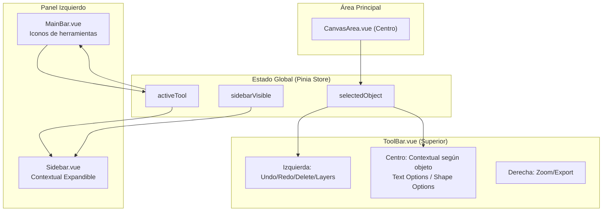

# Plan de Reestructuración - Componentes Canva

## Estructura Actual vs Nueva Estructura

### Estructura Actual
```
CanvaView.vue
├── CanvaToolbar.vue        (barra superior con todo)
├── CanvaSidebar.vue        (barra izquierda con iconos + panel expandido)
├── CanvasEditor.vue        (área central)
├── PropertiesPanel.vue     (panel derecho - propiedades)
├── TemplatePanel.vue       (panel izquierdo condicional)
└── AITool.vue              (panel derecho condicional)
```

### Nueva Estructura Propuesta
```
CanvaView.vue
├── ToolBar.vue             (barra superior)
│   ├── Izquierda: Undo/Redo + Controles de objeto (eliminar, posición)
│   ├── Centro: Opciones CONTEXTUALES según herramienta/objeto seleccionado
│   └── Derecha: Zoom + Exportar + Guardar
├── LeftPanel               (Contenedor izquierdo)
│   ├── MainBar.vue         (Iconos de herramientas - estrecho)
│   │   └── Select, Shapes, Text, Images, Draw, AI, Filters, Templates, Settings
│   └── Sidebar.vue         (Panel expandible contextual)
│       ├── Puede ocultarse con botón en borde
│       ├── Text Tool: Tipos de texto (Heading, Subheading, Paragraph) + Fuentes
│       ├── Shapes Tool: Tipos de formas
│       ├── Select Tool: Canvas Settings (cuando no hay objeto)
│       ├── Templates Tool: Grid de plantillas
│       ├── AI Tool: Herramientas de AI
│       └── Images Tool: Upload/galería
├── CanvasArea.vue          (área central - renombrado de CanvasEditor)
└── (eliminar PropertiesPanel - funcionalidad distribuida)
```

## Cambios Detallados por Componente

### 1. ToolBar.vue (antes CanvaToolbar.vue)
**Ubicación:** Barra superior

**Secciones permanentes (siempre visibles):**
- **Izquierda:**
  - Undo/Redo
  - Separador
  - Delete (cuando hay objeto seleccionado)
  - Bring to Front / Send to Back (cuando hay objeto seleccionado)

- **Derecha:**
  - Zoom controls (In/Out/Reset + porcentaje)
  - Separador
  - Load JSON
  - Save to Library
  - Export (PNG/JPEG/SVG/JSON)

- **Centro (CONTEXTUAL):**
  - **Text Tool activa:** Muestra opciones de texto (fuente, tamaño, bold, italic, underline, alineación, color, efectos)
  - **Shape seleccionada:** Muestra opciones de forma (fill, stroke, etc.)
  - **Image seleccionada:** Muestra opciones de imagen
  - **Ninguna herramienta/objeto:** Espacio vacío

### 2. MainBar.vue (antes CanvaSidebar.vue)
**Ubicación:** Barra izquierda (iconos verticales)

**Contenido:**
- Select Tool (V)
- Shapes Tool
- Text Tool
- Images Tool
- Draw Tool
- Templates Tool
- AI Tool
- Filters Tool
- **Settings Tool (NUEVO)** - Muestra Sidebar con Canvas Settings

**Cambios:**
- Eliminar panel expandido (se mueve a Sidebar)
- Mantener solo iconos de herramientas
- Eliminar sección de tipos de texto (Heading, Subheading, Paragraph)
- Agregar botón Settings al final para acceder a Canvas Settings cuando Sidebar está oculto

### 3. CanvasArea.vue (antes CanvasEditor.vue)
**Ubicación:** Centro

**Cambios:**
- Renombrar manteniendo toda la funcionalidad actual
- Sin cambios en la lógica interna

### 4. Sidebar.vue (NUEVO - Panel expandible izquierdo)
**Ubicación:** Izquierda, junto al MainBar

**Características:**
- Contextual según herramienta activa
- Botón para ocultar/mostrar en el borde derecho del panel
- Se expande/colapsa al lado del MainBar
- Ancho fijo cuando está expandido (~256px)

**Contenido por herramienta:**
- **text (herramienta activa):**
  - Título: "Add Text"
  - Lista de tipos de texto:
    - Add a heading
    - Add a subheading
    - Add a paragraph
  - Separador
  - Lista de fuentes disponibles

- **shapes (herramienta activa):**
  - Título: "Shapes"
  - Grid de formas disponibles
  - Opciones de color/fill

- **select (sin objeto seleccionado):**
  - Mensaje: "Select an object to edit its properties"
  - Canvas Settings básicos

- **settings (NUEVO - herramienta activa):**
  - Título: "Canvas Settings"
  - Background color
  - Canvas Size (width/height inputs)
  - Scale content on resize (checkbox)
  - Apply Resize button
  - Separador
  - Quick Resize Presets:
    - Instagram Post (1080x1080)
    - Instagram Story (1080x1920)
    - HD Video (1920x1080)
    - Facebook (1200x630)

- **templates:**
  - Grid de plantillas disponibles

- **ai:**
  - Panel de herramientas AI

- **images:**
  - Upload button
  - Gallery de imágenes recientes

- **filters:**
  - Filtros para imágenes (cuando imagen seleccionada)

## Flujo de Datos



## Archivos a Modificar/Crear

### Renombrar (preservando historial Git):
1. `CanvaToolbar.vue` → `ToolBar.vue` (barra superior)
2. `CanvaSidebar.vue` → `MainBar.vue` (solo iconos izquierda)
3. `CanvasEditor.vue` → `CanvasArea.vue` (área central)

### Crear nuevo:
1. `Sidebar.vue` - Panel expandible izquierdo contextual (al lado de MainBar)

### Modificar:
1. `CanvaView.vue` - Actualizar imports y layout completo
2. `PropertiesPanel.vue` - Deprecar (funcionalidad se distribuye)
3. `stores/canva.ts` - Agregar estado `sidebarVisible`
4. `index.ts` - Actualizar exports

### Preservar (sin cambios o mínimos):
- `TextStylePanel.vue` - Referencia para opciones de texto en ToolBar
- `FilterTool.vue` - Se usará en Sidebar cuando imagen seleccionada
- `AITool.vue` - Integrar en Sidebar cuando herramienta AI activa
- `TemplatePanel.vue` - Integrar en Sidebar cuando herramienta Templates activa

## Layout Visual

```
┌─────────────────────────────────────────────────────────────────────┐
│  ToolBar.vue                                                        │
│  [Undo][Redo] | [Delete][↑][↓] |    [Contextual Area]    | [Zoom] │
│                                  [Font|Size|Bold|Italic...]         │
└─────────────────────────────────────────────────────────────────────┘
┌──────────┬──────────────────────────────────────────┬───────────────┐
│ MainBar  │                                          │               │
│ [Select] │                                          │               │
│ [Shapes] │                                          │               │
│ [Text] ──┼──► Sidebar.vue (expandible)              │  CanvasArea   │
│ [Images] │   ┌─────────────────────┐                │     (Canvas)  │
│ [Draw]   │   │ Text Styles         │                │               │
│ [AI]     │   │ [Heading]           │                │               │
│ [...]    │   │ [Subheading]        │                │               │
│ [⚙️]─────┼──►│ Canvas Settings     │                │               │
│ Settings │   │ [1080x1080] etc     │                │               │
│          │   └─────────────────────┘                │               │
│          │             [◀] Toggle                   │               │
└──────────┴──────────────────────────────────────────┴───────────────┘
```

## Beneficios de la Nueva Estructura

1. **Separación de responsabilidades claras:**
   - ToolBar: Acciones globales + contextuales de edición
   - MainBar: Selección de herramientas
   - Sidebar: Configuración específica de herramientas

2. **Mejor UX:**
   - Opciones de edición siempre visibles en ToolBar
   - Sidebar puede ocultarse para más espacio
   - Contexto claro según herramienta activa

3. **Escalabilidad:**
   - Fácil agregar nuevas herramientas
   - Fácil agregar nuevas opciones contextuales
   - Componentes más enfocados y reutilizables
